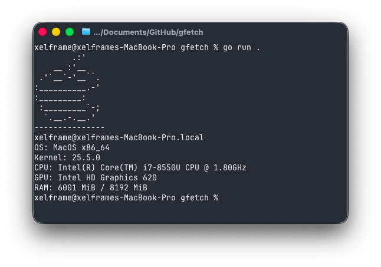

# gfetch

### Minimal system info fetch written in Go

### Made for the purpose of studying Go

### Supported:

- Arch Linux
- CachyOS
- Void Linux
- Ubuntu
- Linux Mint
- Debian
- Fedora Linux
- NixOS
- Gentoo Linux
- Alpine Linux
- --
- Windows
- --
- MacOS (Shows only one GPU)
